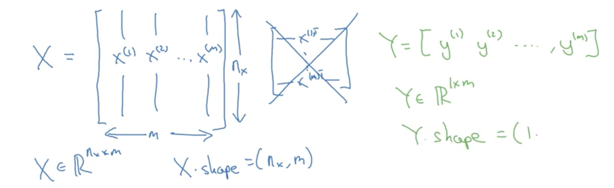
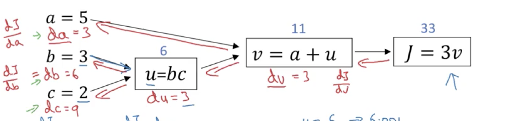
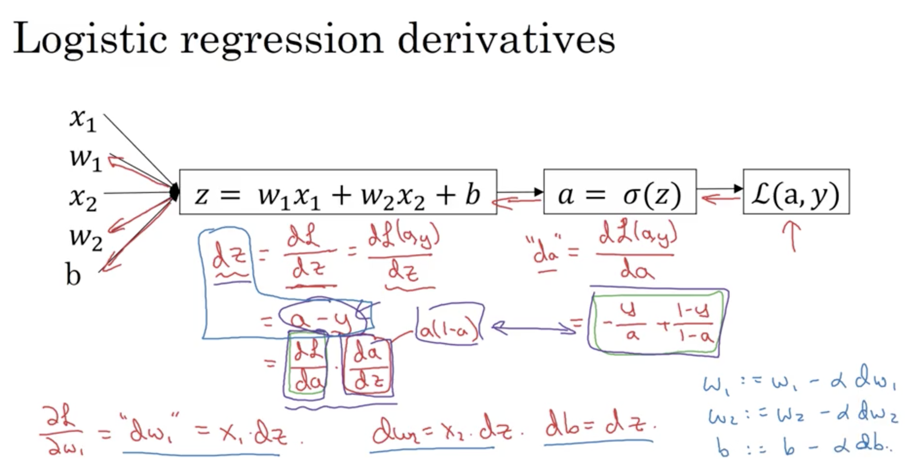

**Series Outline**

- Neural Networks and Deep Learning
- Improve NN: Hyperparameter tuning, Regularization and Optimization
- Structuring your Machine Learning project
    train/dev/test
- Convolution Neural Networks
- NLP: Building sequence models
    + RNN

    + LSTM 

Notation

>
m - Number of training set

# Course One


## Week 1

### Introduction ot Deep Learning


**Relu** - common used
Rectified Linear Unit (most popular activation function right no)


**Supervised Learning Examples**


#### **Why NN becomes powerful recently**

- Data
- Computation
- Algorithms


**Data**


But for small training set, the performance of an algorithm is mosly depending the engineering on feature. The ordering of algorithns is unknown.

**Algorithms and Computation**

- Sigmoid -> ReLU: make gradient decent faster


- Training NN is very iterative 


## Week 2 logistic regression (binary classification ) as neural network

Forward propagation
Backward propagation 


### Logistic regression

#### Image Data

3 matrces （RGB）
-> unroll a feature vector 

a 64 * 64 image will have nx = 64 * 64 * 3 features



$X \in \mathbb{R}^{n_x * m}$

#### Hypothesis Function

Given X, want $\widehat{y} = P(y=1|x), 0 < y < 1$

$\widehat{y} = \sigma(\omega^Tx)$

$\sigma$ is sigmoid function
$\sigma(z) = \frac{1}{1 + e^{-x}}$

#### Cost Function

Given ${(x^{(0)},y^{(0)}),..., (x^{(m)},y^{(m)})}$, want $ \widehat{y}^{(i)} \approx y^{(i)}$.

- $y^{(i)}$ is the ground true label

Loss(error) function:
$L(\widehat{y},y) = 1/2 (\widehat{y}-y)^2$ 

Logistic regression **do not use this function** because the objective function for training (optimization) will becomes non-convex

Instead it uses 
$L(\widehat{y},y) = - (ylog\widehat{y} + (1-y)log(1-\widehat{y}))$
This function will give us a convex cost function.

Loss function is defined with regard to a single training example.
While cost function is with regard to whole training set.

$J(w,b) = \sum\limits_{i=1}^n L(\widehat{y}^{(i)},y^{(i)})$

#### Traning (Gradient descend)

Find $w,b$ that minimize $J(w,b)$

> Since for logistic regression, the cost function is convex function, any intial point will work

$ \omega := \omega - \alpha \frac{\partial J}{\partial \omega}$
$ \omega := b - \alpha \frac{\partial J}{\partial b}$

> In code
$d\omega$ denotes $\frac{\partial J}{\partial \omega}$ 
$db$ denotes $\frac{\partial J}{\partial b}$


#### Derivative with computation graph

**Final output variable**

> In code, dvar denotes $\frac{\partial FinalOutputVariable}{\partial var} $ - the derivative of final output variable
dv denotes $\frac{\partial J}{\partial v}$

**Back Propagation**
**Chain Rule**


#### Derivative of logistic regression

Review equations 

$z = \omega^Tx$
$\widehat{y} = a = sigma(z) = \frac{1}{1 - e^{-z}}$
$L(a,y) = - (yloga + (1-y)log(1-a))$
$J(w,b) = \frac{1}{m}\sum\limits_{i=1}^m L(\widehat{y}^{(i)},y^{(i)})$





$\frac{\partial}{\partial \omega_i}J(w,b) = \frac{1}{m}\sum\limits_{i=1}^m \frac{\partial}{\partial \omega_i} L(\widehat{y}^{(i)},y^{(i)})$

> When implementing deep learning algorithms for traning large data set, if use explicit for loop, you will find your code less efficient. Use technique called **vectorization** to get rid of the explicit for loops.

#### Final Algorithm

$J=0; dw_1=0; dw_2=0; db=0;$
for i = 1 to m:
&emsp;$z^{(i)} = \omega^T x$
&emsp;$a^{(i)} = \sigma(z^{(i)}) = \frac{1}{1 + e^{(-z)}}$
&emsp;$J += -[y^{(i)}log(a^{(i)}) + (1-y^{(i)})log(1 - a^{(i)})]$
&emsp;$dz = a^{(i)} - y^{(i)}$
&emsp;$dw_1 += x_1^{(i)}dz^{(i)}$
&emsp;$dw_2 += x_2^{(i)}dz^{(i)}$
&emsp;$db += dz^{(i)}$

$J /= m$
$dw_1 /= m$
$dw_2 /= m$

> The implementation will use two loops. One loop through each training examples. Another loop through features.

### Python and Vectorization

#### Vectorization


```python
import numpy as np
np.dot(a,b)
```

> Whenever possible, avoid using explicit for-loops.
`numpy.dot` use Single Instruction Multiple Data(SIMD) to parallelize the computation. **Both CPU and GPU** can apply SIMD. Most modern CPU designs include SIMD instructions to improve the performance of multimedia use.


```python
# do exponential to each elements of a vector
import numpy as np
u = np.exp(v)
np.log(v)
np.maximum(v,0) # return a vec of size(v)
v**2
1/v

# Logistic Regression Algorithm Vectorized version
## Forard Propagation
X = [x_1, ... x_m]  # (nx, m)
y = [y_1,..., y_m]  # (1, m)
b   # scalar
Z = np.dot(w,X) + b   # (1, m). +b is called boardcasting in python
A = 1/(1 - np.exp(-z))  # (1,m)
J = -[np.dot(y, np.log(a)) + np.dot((1 - y), np.log(1-a))] # scalar

## Backpropagation
dZ = A - Y
dW = 1/m * np.dot(X, dZ)
db = 1/m * np.sum(dZ)

## Update
w = w - alpha * dW
b = b - alpha * dW
```

#### numpy Broadcasting
```python
a = [1,2,3,4]
a + 100 = a + [100, 100, 100, 100]

# For a (m,n) matrix, +-*/
## a (1,n) matrix. It will copy the (1,n) matrix m times into a (m,n) and then do element-wise operation.

## a (m,1) matrix. It will copy the (m,1) matrix n times into a (m,n) and then do element-wise operation.

cal = np.sum(axis=0) # sum matrix vertically
pct = 100*A/cal.reshape(1,4)
```
> reshape is very cheap to use (O(1)). Only use it make sure the matrix dimension is correct. 

#### Explanation of logistic regression cost function

$y \in {0,1}$ and $\widehat{y}$ is the probablity that $y=1$ we predict. Then,
for $y = 1$, $p(y|x) = \widehat{y}$
for $y = 0$, $p(y|x) = 1 - \widehat{y}$

Unify the equation:
$p(y|x) = \widehat{y}^y (1-\widehat{y})^{(1-y)}$
$log(p(y|x)) = ylog\widehat{y} + (1-y)log(1-\widehat{y})$

Would like to maximize $p(y|x)$ which the same as maximizing $log(p(y|x))$, thus we minimize:
$-[ylog\widehat{y} + (1-y)log(1-\widehat{y})]$

$p(y|X) = log \prod p(y|x) = \sum log(p(y|x))$

### Summary for Week 2

