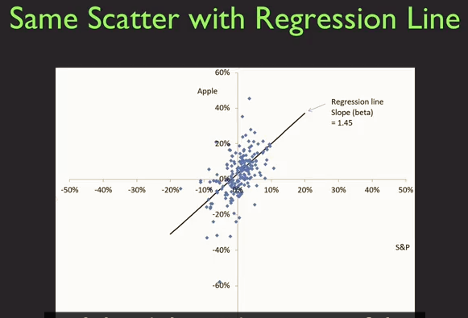
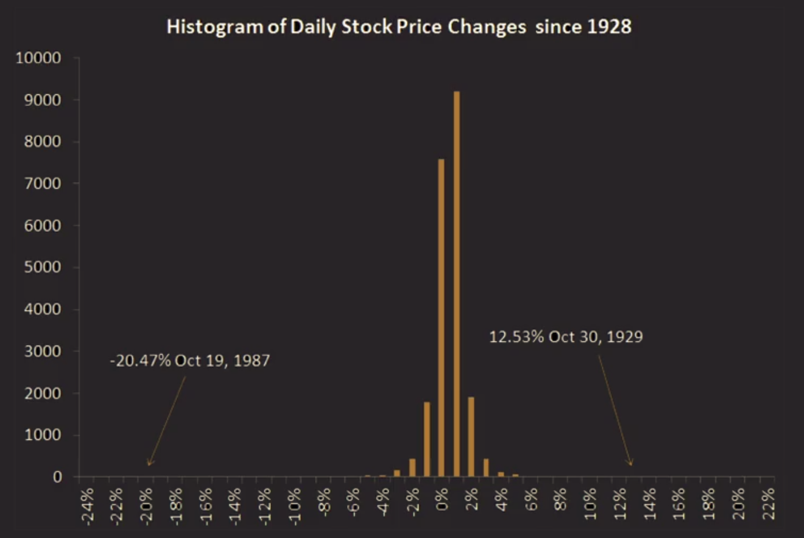

## VaR

**Variance**

**Value at risk**

probability P to lose x money withing y time

**Stress tests**
Usually ordered by government how some firms will stand up to a financial criss. At least test three economic senarios. (regression; dollar depreciation; etc.)

> Dodd-Frank Wall Street Reform and Consumer Protection Act (7/21/2010)

China UK etc. all do stress test now. But doubt whether is will actually work.

## Capital Asset Pricing Model (CAPM)

**Beta**

> Apple overreacts to what happens in the aggregate stock market.

return of S&P vs Apple by month (2000-2016), there should be 12*17=204 data points.

- `Beta` ($\beta_i$) is the regression slope coefficient when the return on the ith asset is regressed on the return on the market.
Apple's Beta is 1.45 (2000-2016), which very high (close to 40 fold earning).

- The CAPM implies that the expected return on the ith asset is determined from its beta

`Market risk vs Idiosyncratic risk`

- `Marekt risk`: apple will do something in react to the stock market
- `Idiosyncratic risk`： apple-only risk. Like "the death of Steve Jobs"

$y = \beta_{apple} x + \alpha $

y - return of Apple
x - return of the market
systematic risk - variance of market return Var(x)
idiosyncratic risk - variance of residual in the regression

$Var(y) = ( \beta^2  Var(x) + Var(Residual))$

>$\beta_i = \frac{COV(r_i, r_{market})}{Var(r_{market})}$
$\beta$ is actually the scaled convariance between single stock return and market return

> The market demands higher returns from higher beta stock.

> The real world is not so cut and dried as I showed here.

**Joe McNay**

The Class of 1954 gave $370,000 for Yale at its 25th anniversary (in 1979) but ask Joe McNay to invest it for 25 years.

They told Joe McNey, take your chance, its fine to lose them all but we trust you.

In 2004, they presented it to Yale, now worth %90 millions, 24.6% year return geometric.

### Distribution and Outliers

**Normal Distribution**
Many random variables in nature follow this distribution but not all of them. It is not In finance. We tend to have outliers or fat tails.

**Cauchy Distribution**
It is fat tailed

**Central Limit Theorem**

- Can fail if the underlying shocks are fat tailed
- Can fail if the underlying shocks lose their independence

> Nassim Taleb's Black Swan

Stock market return is long tailed.

- Noremal distribution with the same mean and standard deviation as the histogram shown has a probability of drop greater than 20% equal to 3*10^-7

## Insurance

>If is share risk, it is come kind of insurance.

> Government are trying to create a system with right incentives.

### Fundamental Insurance Principal and Issues

- `Risk Pooling` is the source of all value in insurance
- If n policies are independent and follow binomial distribution. The standard deviation of the fractrion of policies that results in a claim:
$\sqrt{p(1-p)/n}$
- Law of large number as n gets large, stardard deviation approaches zero.

- `Moral Hazard` dealt with partially by deductions and co-insurance
> Example: I have house fire insurance, I don't care if the house was caught in fire.
- `Selection Bias` dealt with by group policies, by testing and referrals, and by mandatory government insurance.

> Example: Crop can easily have `Moral Hazard` and `Selection Bias` because farmer can lie on the crop yield. Thus crop insurance is not successful. Instead people do insurance on whether, people cannot lie on weather. The problem people have to define weather very preciously.

> Insurance have information value in that let you know say: the house is located at a area where flood was frequently occured.

### Insurance History

- Insurance start from ancient Roma. 
- No compute the probability of death at each age until 16000s.
- Morris Robinson Mutual Life of NY 1840: highly-paid salesmen (agency theory)
- Herny Hyde 1880s: Large cash value (psychological framing)
- Viviana Zelizer: challenging God, tempting fate (psychological framing)
- Inventions copied around the world. (Marking invention: sales pitch that related to let your husband protect you)
- Life insurance is a relic, 

### Insurance regulation

Insurance are all regulated at state-level.

Connecticut Life and Health Insurance Guaranty Association
- Founded 1972
- insure insurance company

> The US Government took over securities regulation in the 1930s after great depression，forming SEC. But insurance do not have a unified regulator (the insurance regulator are at state level - The McCarran-Ferguson Act of 1945).

> National Association of Insurance Commissioners (NAIC) is a industrial non-profit.

### Health Insurance

> If doctors received money when people were sick, then they will have no incentive to prevent people from getting sick. Instead, doctors should pay by salary.

- Obama Care try to deal with `selection bia` problem: forcing everyone to sign up, tax penalty for individuals not buying insurance.

### Disasters

Why Haitian and New Orland people not insured.

### Terrorism Risk

Before 9/11/2001 most of insurance compnay did not exclude terrorism risk because they don't see it as risk.

US Terrorism Risk Insurance Act of 2002 （TRIA). TRIA now has been renewed for several times. In 2015, it was renewed again to 2020.

## Portfolio Management

An Alternative to Insurance: Diversify your asset.

### Hedge Fund
 
- Not allowed to advise themselves
- Has to be a accredit investor to invest in hedge
- pay very high to their investment manager if they outperform

### Capital Asset Pricing Model (CAPM)

Inverstment as Providers of Diversification

- Investment trust (before 1940s)
- Mutual funds (especially index fund)

Doubts about Diversification

Relationship between the expected return of an asset and its beta.

$r_i = r_f + \beta_i(r_{market} + r_f)$

Two assumption:

- The theory of forming an optimal portfolio
- Every does the portfolio management. (Which might not be the truth)
- Everybody is rational

> - Idiocratic risk will be averaged out.
> - Beta is more relavant
> - A negative beta asset (like gold) play the role of insurance in your portfolio
> - Security is regluated by Securty Exchange Commission (SEC), while insurance is regulated by state government
- Short selling is not allowd

### Model details

Risky Asset: X dollars -> return $r_1$
Riskless Asset: 1-X dollars -> return $r_f$

Portfolio Expected Value: $r = xr_1 + (1-x)r_f$
Portfolio Variance:        $x^2var(return_1)$
Protfolio Stardard Deviation: $\sigma = |\frac{r-r_f}{r_1-r_f}|\sigma(return_1 )$

### Short Sales - 做空

Borrow stocks and sell and buy them back when price goes down.

### My Question

1. How the assumption of rational people reflect in CAPM?

2. What does it mean to be rational?

