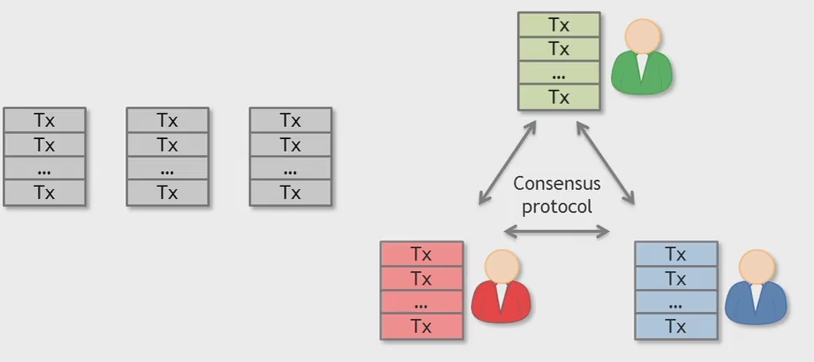
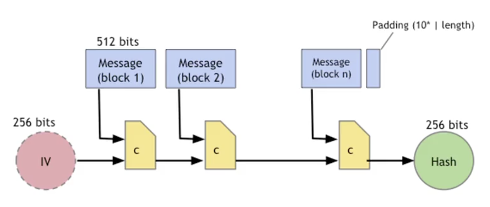
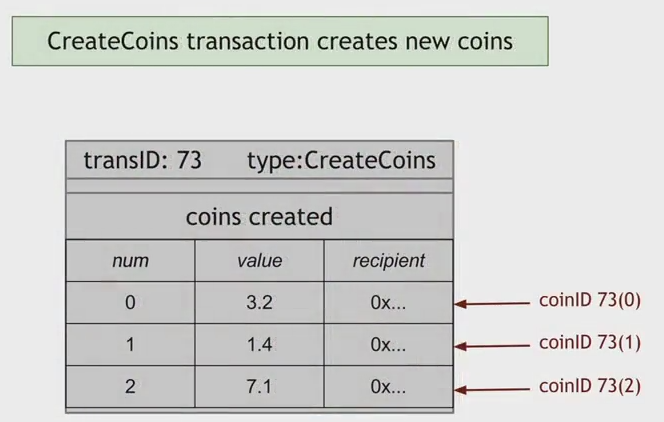
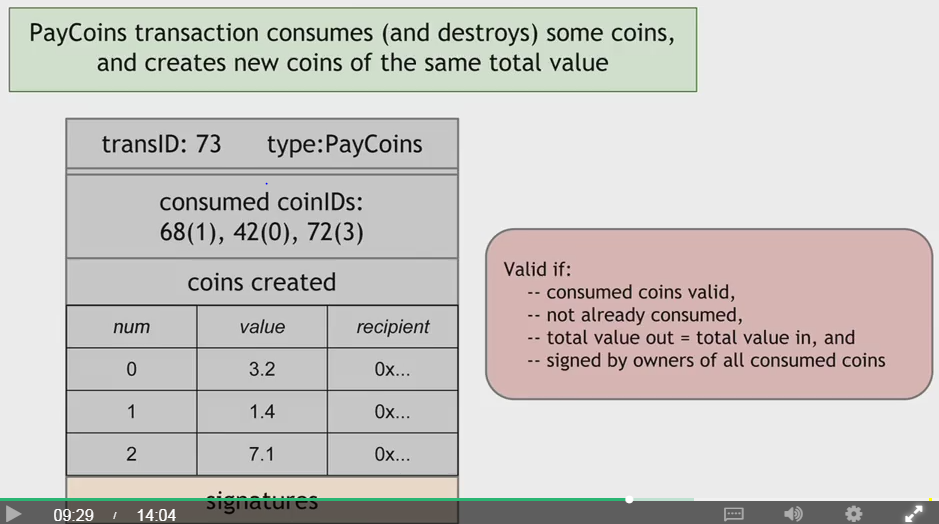

[toc]

# W2 

## 2.1 Centralization vs Decentrailization

Decentralization:
- E-mail SMTP

### Aspects of decentralization in Bitcoin
Peer-to-peer network
	open to anyone, low barrier to entry 
Mining
	open to anyone, but inevitable concentration of power which is quite undesirable
Updates to software:
	core developers trusted by community

## 2.2 Distributed Consensus

Traditional motivation: reliability in distributed systems.
- Google or facebook will store data more than one database, so need to save on all dbs or no dbs
- Distributed key-value store enables various applications:
	+ DNS
	+ public key directory
	+ stock trades

**How consensus could work in Bitcoin**
At any given time:
- All nodes have a sequence of blocks of transactions they've reached consensus on
- Each node has a set of outstanding transaction it's heard about (since data transfer through network is not instantaneous, each node has it's own version of outstanding transaction yet. Those transactions hasn't reach a consensus yet.)

**Why consensus is hard**
- Nodes may crash
- Nodes may be malicious

Network is imperfect
- Not all pairs of nodes connected
- Faults in network
- Latency (No notion of global time, so there will be disagreement of the sequence of transaction

**Many impossibility results**
- `Byzantine generals problem`
- `Fischer-Lynch-Paterson (deterministic nodes)`: concensus impossible with a single faulty node

example: Paxos
It nevere produces inconsistent results, but can (rarely) get stuck

> If we use a certain authorized node to determine which block to put on the chain (consensus), we will face the following problems
- Certain node not connected to the authorized node may never get boardcasted message processed

### Bitcoin consensus

**Bitcoin consensus works better in practice than in theory. Theory is still catching up. But theory is important, can help predict unforeseen attacks**

Introduces incentives
- Possible only because it's a currency

Embraces randomness
- Does away with the notion of a specific end-point
- Consensus happens over long time scales - about 1 hour

## Questions 
- What is impossibility results? Consensus impossibility?

# W1

##  1.1 Intro to Cryto

### Cryptographic Hash Functions

> Definition by wikipedia: A hash function is any function that can be used to map data of arbitary size to data of fixed size.

Hash function

- Takes any string as input
- Fixed-size output (256)
- Efficiently computable

Security properties

- collision-free
- hiding
- Puzzle-friendly

#### Collision-free

You can't find x!=y such that H(x) = H(y)

Collisions do exist. Because there are more possible input than possible outputs (2^256) .

But it cannot be found by regular people using regular computer.

- So how to find colision?

Try 2^130 randomly chosen input. 99.8% change that two of them will collide. This works no matter what H is. It takes too long to matter. Using all computing power for more than 5 billion years is still not possible.

- Is there a faster way to find collisions?

> For some possible H's, yes. No H has been proven collision-free.

##### Application: Hash as message digest

If we know H(x) = H(y), it's safe to assume that x=y. To recognize a file that we saw before just remeber its hash. Useful, because hash is small.

#### Property 2: Hiding

Given H(x), it is infeasible to find x.

But, if there is limit possible input, its able to find x. More specifically, 

**The Hiding Property**
If r is chose from a probabliy distribution that has high min-entropy, then given H(r|x), it is infeasible to find x.

High min-entropy means that the distribution is "very spread out", so that no particular value is chosen more than negligible probability. r|x means concatenate r and x.

##### Application: Commitment
??
Commit a value and reveal it later.
commit(*msg*) := (H(key|msg), key)  
// key is a random 256-bit value
verify(*com*, *key* , *msg*) := (H(key|msg) == com)

Security Properties:
- Hiding: Given H(key|msg), infeasible to find msg
- Binding(collision free): Infeasible to find msg != msg' such that H(key|msg) = H(key|msg')

#### Property 3: Puzzle-friendly

Application: Search puzzle

Given a "puzzle ID" id (from high min-entropy distrib.), and a target set Y:
Try to find a "soultion" x such that
	H(id|x) ∈ Y.
Puzzle-friendly property implies that no solving strategy is much better than trying random values of x.
Note that the id is generated ramdomly. This property is applied in bitcoin mining.

### SHA-256 hash function (the function bitcoin used)

if c is collision free than the function is collision free.

### Wikipedia's statement about the properties of hash function

- it is deterministic so the same message always results in the same hash
- it is quick to compute the hash value for any given message
- a small change to a message should change the hash value so extensively that the new hash value appears uncorrelated with the old hash value
- it is infeasible to generate a message from its hash value except by trying all possible messages (**hiding**)
- it is infeasible to find two different messages with the same hash value (**collision free**)

## 1.2 Hash Pointers and Data Structures

### Hash Pointer

### Blockchain

### Merkle Tree (binary tree with hash pointers)

**Proving a member of Merkle Tree**

show O(log N) items

**Advantages**

- Just need to remember root hash of the tree
- Verify membership in O(log n) time/space

**Variant of Merkle Tree**

Sorted Merkle tree: can verify non-membership in O(log n)

## 1.3 Digital Signatures

**Requirements**
- Only you can sign, but anyone can verify
- Signature is tied to a particular documents (can't be cut-and-pasted to another doc)

### API for digital signatures

1. $(sk, pk) := generateKeys(keysize)$ 
2. $sig := sign(sk, message)$
3. $isValid := verify(pk, message, sig)$

1,2 can be randomized. 3 is deterministic.

where, sk = "secret key", pb = "public key"

#### Requirements for signatures

1. verify(pk, message, sign(sk, message)) == true
2. **Unforgeability**: who knows `pk`, `message` and `sig`, can't produce a verifiable signature on another message.

Explain: 
For $i = 1, 2, ... n$ where $n$ is a plausible number, given sigs that satisfies $verfiy(pk, m_i, sig == true$, the attacker cannot produce any message $M$ not in ${m_1, m_2, ... m_n}$ and its signature $sig$ that satisfies $verfiy(pk, M, sig) == true$

**Practical stuff**

algorithms are randomized
	need good source of randomness (attacks on the source of randomness is the favoritate trick)
limit on message size
	fix: use Hash(message) rather than message
fun trick: sign a hash pointer
	signature "covers" the whole structure

#### Bitcoin's Algorithm

Elliptic Curve Digital Signature Algorithm (ECDSA) - hairy math.

**good randomness is essential**. Its important in both generateKeys() and sign()

## 1.4 Public Key As ID

To "speak for" pk, you must know matching secrest key sk.

### How to create a new ID

generate (sk, pk)
pk is the public "name" you can use (pk is large, usually we use the Hash(pk))

sk lets you "speak for" the identity

Bitcoin's address is actually pk.

### Decentralized Identity Management

### Privacy

- Just a pk, Not directly connected to read-world identity
- But any observer an link together an address's activity over time and make infereneces

> So change address frequently?

## 1.5 A simple Cryptocurrency

### GoofyCoin

1. Goofy can `CreateCoin[uniqueCoinID]`
2. A coin's owner can spend it.

`Double spending` is the main design chanllenge that we face in designin a cryptocurrency.

### ScroogeCoin

Scrooge publishes a history of all transactions (a block chain, signed by Scrooge)

Trans Types
- CreateCoins
	+ a array of coinID, num,value, recipient
	+ Only Scooge can do and always `valid`.

- PayCoins
	+ consumed coins(ID) valid
	+ not already consumed
	+ total value out = total value in 
	+ signed by owners of all consumed coin

> If you would like to subdivide coins, you can make a transaction that consume one coin with high value and create two smaller coin to yourself.

immutable coins?

Problem: Scooge is the God. Centralized.  
How many number of transactions need ?

**Scrooge's work done on each block**
In each block, Scrooge will receive a list of transactions, validate the transactions he receives, and publish a list of validated transactions.

## Questions 

- How how exactly the process is to prove a member of Merkle Tree. [1.2]
- How exactly SHA256 works?
- How exactly ECDSA works?
- Say A sign the message that send 1btc to B. What happend if B reuses the signature to pretend A?
	+ Each transaction will use certain unused output and each output can only be used once. The unused output has already been used. So no btc will be sent to B again. Conclusion: signature for transcation can only be used once.