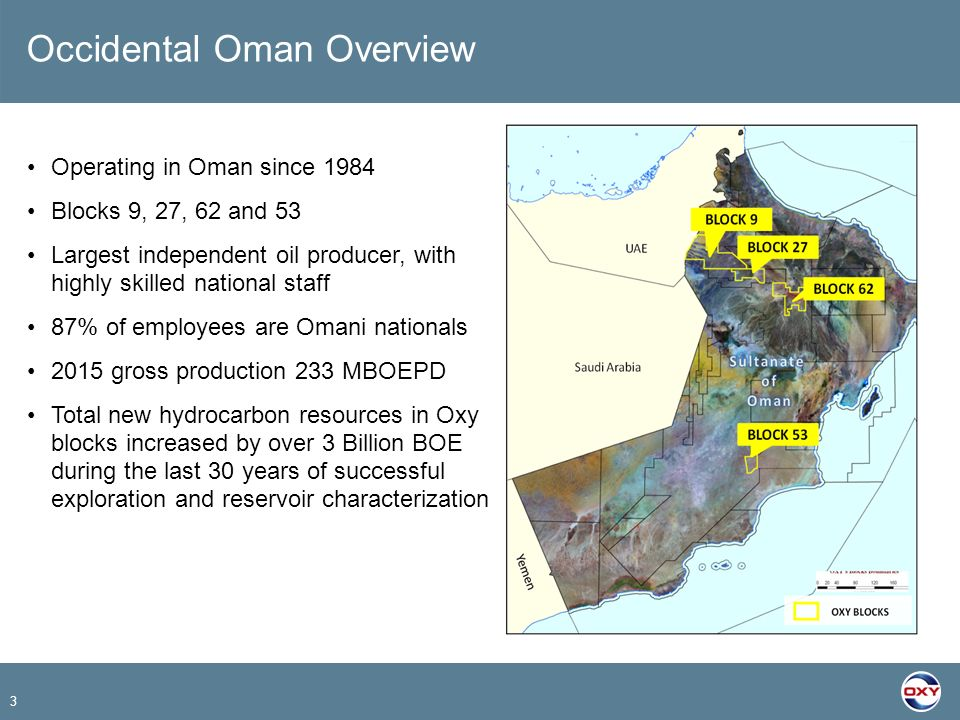
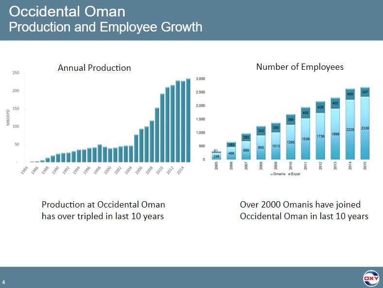

## Oxy slides

[2017-wells-fargo-west-coast-energy-conference-by-Richard Jackson](https://seekingalpha.com/article/4083320-occidental-petroleum-corporation-oxy-presents-2017-wells-fargo-west-coast-energy-conference)

[Wood Machenzie Report](https://www.woodmac.com/reports/upstream-oil-and-gas-mukhaizna-block-53-4316592)

## Oman

### Intro

#### Oman North

**Block 9**

The Block 9 (Suneinah) contract area is located in northwest Oman and contains nearly 60 proven fields. Around 75% of the discovered fields have been successfully developed. The largest field, Safah, was brought onstream in 1984 and has produced the majority of oil and gas in the block. More recently, production has increased from the Wadi Latham fields, with the Safah and Wadi Latham areas both producing at similar levels.

Safah is the largest one oxy operate.  

**Block 27**
Locates west of Muscat and is approximately 2,500 square kilometers

**Block 62 - Habiba**
The Occidental operated Block 62 (Habiba) contract area is located in central Oman, adjacent to PDO's prolific producing Kauther gas field. The block was previously part of PDO's Block 6 before award to Occidental in 2008. Four gas fields, originally discovered by PDO, were to be developed: Fushaigah, Maradi Huraymah, Rasafah and Habiba. The Fushaigah field was brought onstream in January 2016, tied back to PDO's Kauther facilities in adjacent Block 6, followed by the Maradi Huraymah field which has its own dedicated processing facility.

Gas plant in Maradi Huraymah Field.

#### Oman South

**Block 53**

Mukhaizna (South Oman), heavy oil steam flood
Thulielat and Kahmah / Khuff 

### News

Occidental Petroleum has been awarded a new production sharing contract area, Block 54, in southeastern Oman immediately adjacent to Block 53. The Block 54 contract area is approximately 5,620 square kilometers.

In 2017, Occidental was awarded a three-year exploration contract in
Block 30. 

Occidental supports the Sultanate’s In-country Value (ICV) program, sponsored by the Ministry of Oil and Gas, which promotes Oman-based manufacturing and service providers.

### Block 53 - Mukhaizna
Mukhaizna is the largest heavy oil steam flood in Middle East. Over 2600+ new wells since Oxy take over since 2005. It is one of only three world-leading steam-flood oil recovery schemes alongside comparably sized developments in Canada and Indonesia. 

There two reservoirs. 
- Gharif reservoir with 2.5 BBO heavy oil. sandstone. UG, MG zones. TVDSS: 2000 - 2800 fts
- Thulielat and Kahmah / Khuff  reservoir with 0.8 BBO heavy oil. Cabonate. Shallow zones.

### Production

Oman Weekly Production Report as of (Sep 30, 2018)

**GROSS**
| Gross   MBOEPD | Daily | Prev Daily | 7 Day AVG | 7 Day AVG    | MTD Avg | MTD AVG      | Current Month  | Last Month Avg |
|----------------|-------|------------|-----------|--------------|---------|--------------|----------------|----------------|
|                |       |            |           | (1 Week Ago) |         | (1 Week Ago) | Outlook        |                |
| Block 9        | 96.6  | 95.4       | 94.1      | 94.5         | 95.5    | 95.8         | 95.5           | 95.4           |
| Block 53       | 113.5 | 119.8      | 117.2     | 118.7        | 118.4   | 119.1        | 116.6          | 118.6          |
| Block 27       | 13.6  | 14.1       | 13.8      | 14.1         | 13.7    | 13.7         | 14.3           | 13.8           |
| Block 62       | 24.1  | 24.1       | 24        | 23.9         | 24      | 24           | 23.6           | 24             |
| Total   Gross  | 247.8 | 253.4      | 249.1     | 251.2        | 251.6   | 252.6        | 249.9          | 251.8          |

**NET**
| Net   MBOEPD | Daily | Prev Daily | 7 Day AVG | 7 Day AVG    | MTD Avg | MTD AVG      | Current Month  | Last Month Avg | Current Month  | Prev Month Net  |
|--------------|-------|------------|-----------|--------------|---------|--------------|----------------|----------------|----------------|-----------------|
|              |       |            |           | (1 Week Ago) |         | (1 Week Ago) | Outlook        |                | Net Interest % | Interest %      |
| Block 9      | 24.9  | 24.6       | 24.3      | 24.4         | 24.6    | 24.7         | 24.6           | 24.75          | 25.81          | 25.93           |
| Block 53     | 31    | 32.8       | 32.1      | 32.5         | 32.4    | 32.6         | 31.9           | 31.92          | 27.36          | 26.92           |
| Block 27     | 7.3   | 7.6        | 7.4       | 7.5          | 7.4     | 7.3          | 7.6            | 7.36           | 53.53          | 53.5            |
| Block 62     | 22.4  | 22.5       | 22.4      | 22.3         | 22.4    | 22.4         | 22             | 22.33          | 93.25          | 93.08           |
| Oman Net     | 85.7  | 87.4       | 86.1      | 86.7         | 86.8    | 87           | 86.2           | 86.4           |                |                 |