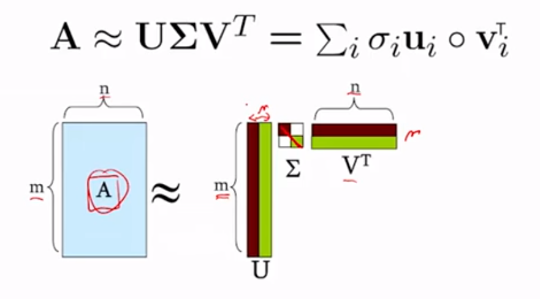
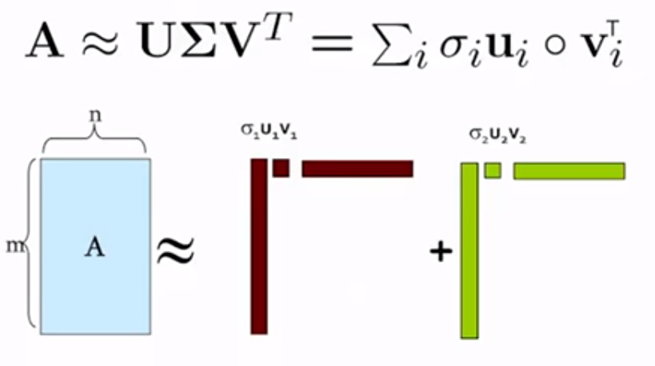
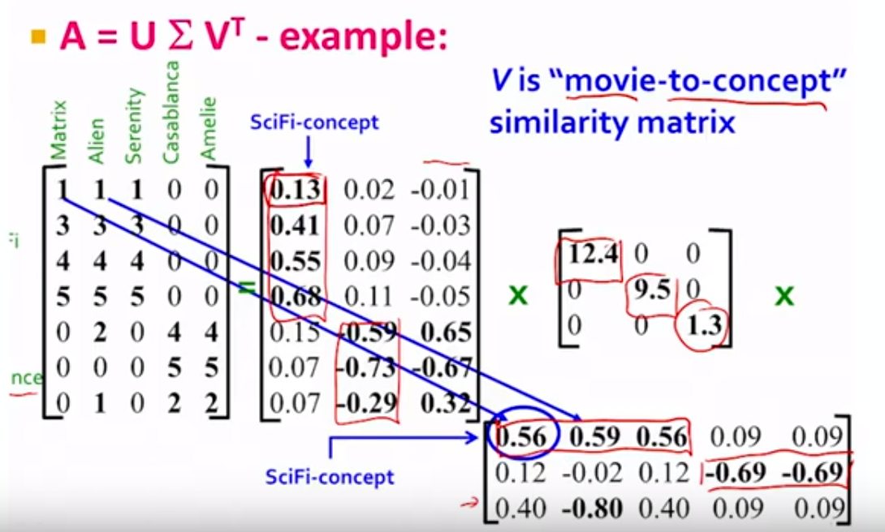

## Linear Algebra

### Basic Concept

#### Orthongonal Matrix

For a real matrix A:

$A^TA=AA^T=I$

$A^T=A^{-1}$

#### Normal Matrix

$A^{*}A=AA^{*}$
where $A^{∗}$ is the conjugate transpose of A. That is, a matrix is normal if it commutes with its conjugate transpose.

A real square matrix A satisfies $A^∗ = A^T$, and is therefore normal if $A^TA = AA^T$.

### Positive Definite

A symmetric $n \times n$ real matrix $M$ is said to be **positive definite** if the scalar $z^TMz$ is positive for every non-zero column vector $z$ of $n$ real numbers. Here $z^T$ denotes the transpose of $z^T$

The **negative definite**, **positive semi-definite**, and **negative semi-definite** matrices are defined analogously, except that in the last two cases 0's are allowed, i.e. the expression $z^TMz$ is required to be always negative, non-negative, and non-positive, respectively.

#### Features

- For any real invertible matrix $A$ , the product $A^TA$ is a positive definite matrix. A simple proof is that for any non-zero vector $z$, the condition $ z^TA^TAz>0$, since the invertibility of matrix $A$ means that $Az\neq0$.
- The example above shows that a matrix in which some elements are negative may still be positive definite. Conversely, a matrix whose entries are all positive is not necessarily positive definite, as for example
- Positive Definite Matrix A plus Positive Semi Definite matrix B is Positive Definite

### Eigendecomposition (spectral decomposition)

$A = VDV^{-1}$

- Where D is a diagonal matrix formed from the eigenvalues of A, and the columns of V are the corresponding eigenvectors of A
- A is a $n*n$ matrix; V is a $n*n$ matrix; D is a $n*n$ diagonal matrix
- Applicable to square matrix $A$
- Comment: Every normal matrix A (i.e., matrix for which $AA^{*}=A^{*}A$, where $A^{*}$ is a conjugate transpose) can be eigendecomposed. For a **normal matrix** A (and only for a normal matrix), the eigenvectors can also be made orthonormal ($VV^{*}=I$) and the eigendecomposition reads as $A=VDV^{*}$. In particular all unitary, Hermitian, or skew-Hermitian (in the real-valued case, all orthogonal, symmetric, or skew-symmetric, respectively) matrices are normal and therefore possess this property.
- for Orthogonal matrix A, $A^T = A^{-1}$

### Sigular Value Decomposition (SVD)

$A = U \Sigma V^T$

- (rotate)(stretch)(rotate). It is always possible to decompose a real matrix A into $A = U \Sigma V^T$. U $\Sigma$ and V are unique.
- U is **left singular vectors**; $\Sigma$ is **Singular values**; V is **right singular vector**; 
- A is a squre matrix of $m*n$
- $\Sigma$ is diagonal matrix of $m*n$ (or $r*r$)
- U ($m*m$ (or $m*r$)) and V ($n*n$ (or $n*r$)) are orthogonal matrix which mean $UU^T=I$ and $VV^T=I$
- $r$ can be think of as the rank of matrix A

$A^TA = (V \Sigma^T U^T) U \Sigma V^T = V \Sigma^T\Sigma V^T = V \Lambda V^{-1}$
 
- $A^TA$ is positive semi-definite, symetrical matrix, its eigenvalues are positive, its eigenvectors are orthogonal
- $\Sigma^T\Sigma$ is $\lambda$ for $A^TA$ which is the $\sigma^2$ for A
- V is the eigenvector matrix for $A^TA$

$AA^T = (U \Sigma V^T) V \Sigma^T U^T = U \Sigma\Sigma^T U^T$
- $\Sigma\Sigma^T$ is $\lambda$ for $AA^T$ which is the $\sigma^2$ for A, actually $\Sigma\Sigma^T = \Sigma^T\Sigma$
- U is the eigenvector matrix for $AA^T$

$A = \begin{bmatrix} u_1 & u_2  \end{bmatrix} \begin{bmatrix} \sigma_1 & 0 \\ 0 & \sigma_2  \end{bmatrix} \begin{bmatrix} v^T_1 \\ v^T_2 \end{bmatrix} = \sigma_1u_1v^T_1 + \sigma_2u_2v^T_2$

- $U_1$ is combination of columns of A
- $V_1$ is combination of rows of A

**Pricipal Component Analysis**

$A \approx \sigma_1u_1v^T_1$ 
- $u_1$ ("best combination of A's columns") and $v^T_1$ ("best combination of A's rows") capture the greatest variance (the most information)

- U: user-to-concept similarity matrix
- V: movie-to-concept similarity matrix
- $\Sigma$ 'strength' of each concept

### Pseudo Inverse

**What is Pseudo-Inverse ($A^+$)?**

Using SVD:
$A = U \Sigma V^T$

$A^+ = V \Sigma^{-1} U^T$

- $\Sigma^{-1}$ may not be invertible, use pseudo inverse

#### Property

For $A^+A$
- If x in the Null space of A ($Ax = 0$), then $A^+Ax=0$
- If x in the Column psace of A ($x = C(A)$), then $A^+Ax=x$, $A^+A$ works like Identity matrix.

## Probability

### Concepts

random variable - x
continuous random variable - x
probability density function (PDF) - f(x)
joint probability density function - f(x,y)
mariginal probability density - fx(x), by integrating the joint density over all values of y
conditional probability density - f(x|y)

expected values 
$E[g(x)] = \int_{-\infty}^{+\infty}g(x)f(x)dx$
`E is a linear operator`

variance
$var(X) = E[(X-EX)^2] = E[X]^2 - \mu_X^2$

standard deviation
$\sigma_X =\sqrt{var(X)} $

covariance 
$cov(X,Y) = E[(X-EX)(Y-EY)] = E[(X-\mu_X)(Y-\mu_Y)] = E[XY]-\mu_X\mu_Y$

correlation
$\rho_{X,Y} = \frac{cov(x,y)}{\sigma_X\sigma_Y}$

cross-coveriance matrix
$cov(X,Y) = E[(X-EX)(Y-EY)^T] = E[(X-\mu_X)(Y-\mu_Y)^T] = E[XY^T]-\mu_X\mu_Y^T$

Independent  <-> $f(x,y) = f(x)f(y)$
Independent -> $E[XY] = E[X]E[Y]$ -> Cov(X,Y) = 0 -> uncorrelated
but, X,Y are uncorrelated x-> X,Y are independent

Random Vector

Convariance Matrix - the convariance of random vector